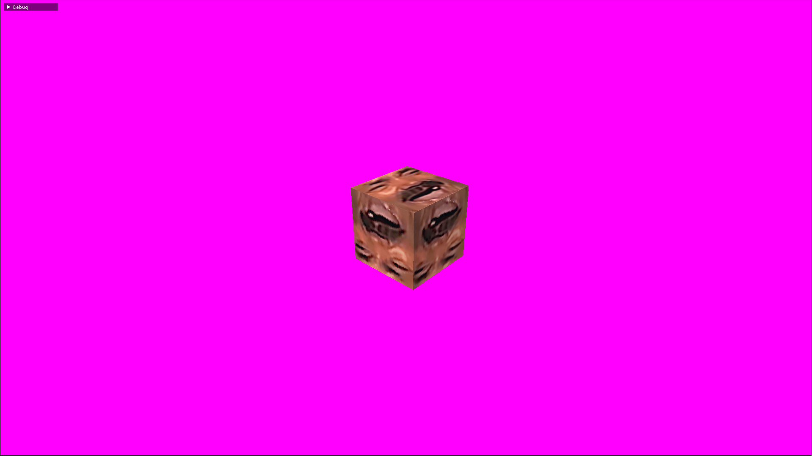
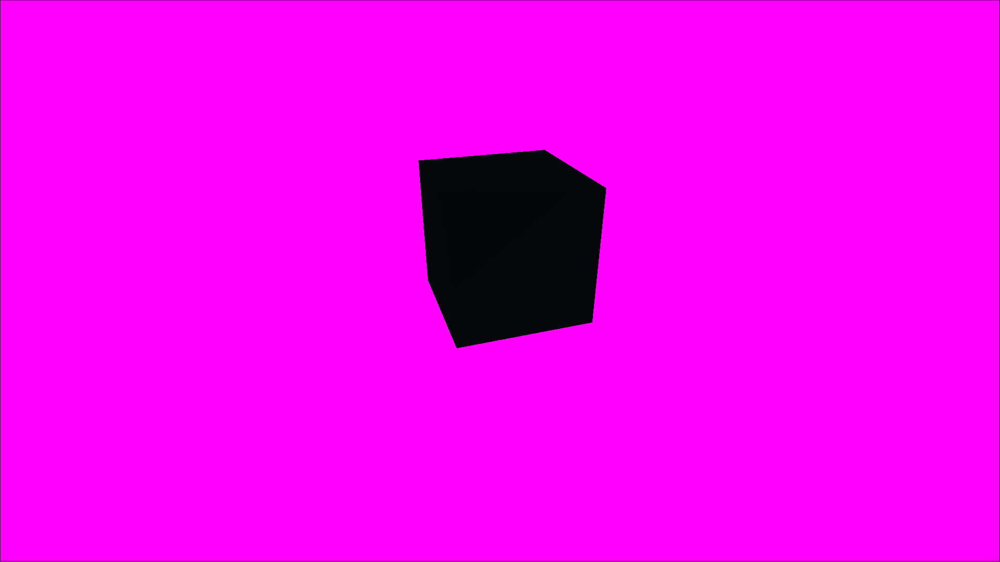
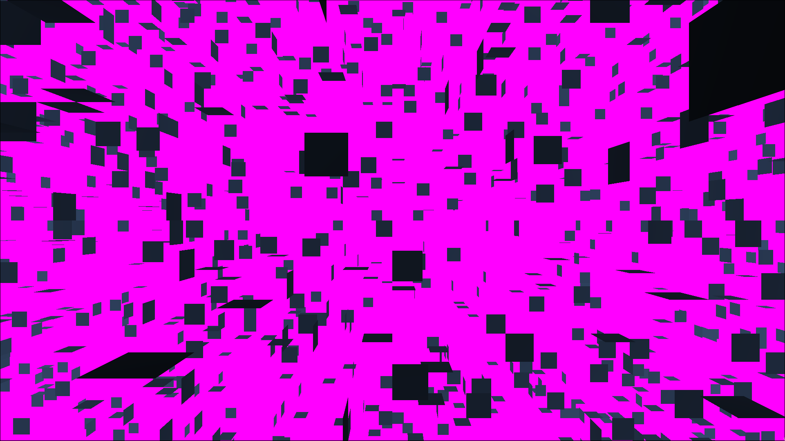

# Screenshots
Dated (DD/MM/YYYY) screenshots, last-come-first-serve. [Go back to the top-level README](../../README.md)

01/01/2026: First textured cube, plus imgui integration for debugging.

31/01/2026: First cube, with a controllable player (FPS camera controls).

28/01/2026: Not very visually different from the last screenshot, but this one
is being rendered using a shiny new scene graph implementation. Also, less quads
are visible because face culling was enabled in the OpenGL renderer.

26/01/2026: First light! Rendering 16384 `Quad`s using the OpenGL backend. 

